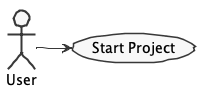

# Repository for RAMDE assignments

The goal of this repository is to serve as a template for the assignments developed during the RAMDE course of the CCS Master Program, edition 2022/23.

**Please follow the instructions of the teachers of your course because they will always prevail over what is stated in this readme file.**

## Folders for Each Assignment

Each part of the project should be inside a specific folder (i.e., folders **assignment1**,  **assignment2**, etc.).

## Documentation
It is mandatory to produce documentation for all your tasks/assignments. The documentaion **must** always be produced in a readme.md file. You should use a readme file inside each assignment folder.

In the readme you should make clear the contribution of each member of the group for each task.

These readme.md files use markdown. You may find further documentation about markdown in [Markdown](https://en.wikipedia.org/wiki/Markdown)

### Producing Technical Diagrams

This repository supports the generation of PlantUML diagrams using Gradle.

The PlantUML diagram files must be included in the **diagrams** folder. The file build.gradle and the folder buildSrc is where the gradle support for PlantUML is located.

To generate diagram simple execute "./gradlew" (or "gradlew.bat" in Windows) in a terminal (having the root of the project as the current folder).

The repository includes an example of a PlantUML diagram in diagrams/usecase.puml.

## Issues and Commits

Each team will have a fork of this repository in bitbucket.

It is a good practice to create an **Issue** in bitbucket for each task that your team or you individually will be developing.

Each commit in your repository should always make a reference to the corresponding issue.

You should also close the issue when the task is finished.

For each deadline/submission of your task/project you should also create a tag in the repository.
